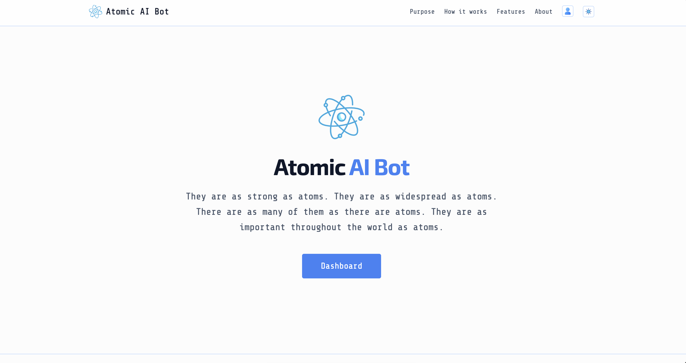

<p align="center">
  
</p>

<p align="center">
  <em>No public usage stats yet — a full official product launch is in preparation.</em>
</p>

<p align="center">
  <strong>Built by <a href="https://t.me/vxdosick" target="_blank" rel="noopener noreferrer">vxdosick</a></strong> — I build web products, Telegram bots, and AI integrations.
</p>

Atomic AI Bot is a self-hosted **AI chatbot widget** for websites: a React dashboard, a FastAPI control plane, and an embeddable chat powered by an OpenAI-compatible LLM (OpenRouter). Drop a script on a landing page, store, or SaaS product and ship customer support without building chat infrastructure.

## Preview

<p align="center">
  
</p>

<p align="center"><em>A hosted official app will also be available soon</em></p>

## At a glance

| | |
|---|---|
| **What** | Service-oriented platform that lets you create an AI support bot, lock it to a domain, theme the launcher, and embed it with one script tag. |
| **For** | Founders, store owners, and product teams who want on-site AI chat without standing up their own LLM gateway. |
| **Why** | Three isolated services (dashboard, API, widget) — clone, fill `.env`, `docker compose up`, embed. Domain checks and the system prompt stay on your backend. |
| **Start** | Docker Desktop + Neon Postgres + Redis (`rediss://`) + OpenRouter + SMTP. Register, verify email, create a bot, paste the snippet. |

## Architecture

Three processes, three Dockerfiles. Compose starts only the platform. Demo shops stay in the repo and run on the host.

```
Dashboard :5173  ──▶  Backend API :8000  ◀──  Widget / chat :8080
        React SPA         FastAPI + JWT              embed + LLM
                              │                         │
                         PostgreSQL                   Redis
                           (Neon)                   (Upstash)
```

| Service | Folder | Port |
|---|---|---|
| Dashboard | [`atomic-ai-bot-frontend`](atomic-ai-bot-frontend) | 5173 |
| Backend | [`atomic-ai-bot-backend`](atomic-ai-bot-backend) | 8000 |
| Widget | [`atomic-ai-bot-widget`](atomic-ai-bot-widget) | 8080 |
| Test shops | [`atomic-ai-bot-test-shops`](atomic-ai-bot-test-shops) | host only — not in Compose |

## Features

- **One-tag embed** — `widget.js` + `data-api-key`. Validate runs on every open and every message.
- **Domain lock** — each bot has one `allowed_domain`. A stolen key does not work on another site.
- **Your voice** — system prompt, launcher label, accent and text color. Live preview in the dashboard.
- **Accounts that behave** — register, verify email, refresh JWT, reset password, delete account.
- **Admin** — users, roles, blocks, bots, active-session counts.
- **History that expires** — Redis transcript, last 10 turns to the model, TTL one hour.
- **Run it yourself** — Docker Compose for the three services; shops are optional examples.

## Embed on any site

Guides in the dashboard, working examples in [`atomic-ai-bot-test-shops`](atomic-ai-bot-test-shops). Create **one bot per site** and paste that token before you start the shop.

<table>
  <tr>
    <td align="center" width="33%">
      <h3>Static HTML</h3>
      <p>One <code>&lt;script&gt;</code> before <code>&lt;/body&gt;</code>.</p>
      <p><code>npx serve … -l 5500</code></p>
    </td>
    <td align="center" width="33%">
      <h3>React</h3>
      <p>Script in <code>index.html</code> or inject once in <code>useEffect</code>.</p>
      <p><code>npm run dev</code> → :5174</p>
    </td>
    <td align="center" width="33%">
      <h3>Node.js</h3>
      <p>EJS / layout partial — same tag, server-rendered.</p>
      <p><code>npm start</code> → :3000</p>
    </td>
  </tr>
</table>

```html
<script
  src="http://127.0.0.1:8080/static/js/widget.js"
  id="atomic-ai-bot"
  data-backend-url="http://127.0.0.1:8000"
  data-api-key="YOUR_BOT_API_KEY"
  defer
></script>
```

Commands and token fields: [`atomic-ai-bot-test-shops/README.md`](atomic-ai-bot-test-shops/README.md).

## Color palette

Tokens from the dashboard theme (`src/index.css`). Light is default; dark swaps on `.dark`.

<p align="center">
  
</p>

| Token | Light | Dark | Role |
|---|---|---|---|
| **background** | `#fcfcfc` | `#111113` | Page |
| **surface** | `#ffffff` | `#18181b` | Cards, inputs |
| **foreground** | `#0f172a` | `#f8fafc` | Primary text |
| **muted** | `#475569` | `#94a3b8` | Secondary text |
| **brand** | `#3b82f6` | `#0ea5e9` | Accent, CTA |
| **brand-hover** | `#2563eb` | `#38bdf8` | Hover |
| **line** | `#bfdbfe` | `#0284c7` | Borders |

<p align="center">
  
  
  
  
</p>

## Quick start

You need [Docker Desktop](https://www.docker.com/products/docker-desktop/), [Neon](https://neon.tech/) (or any Postgres), Redis with TLS ([Upstash](https://upstash.com/) → `rediss://`), an [OpenRouter](https://openrouter.ai/) key, and SMTP.

```bash
git clone <this-repo>
cd atomic-ai-bot

cp atomic-ai-bot-backend/.env.example atomic-ai-bot-backend/.env
cp atomic-ai-bot-widget/.env.example atomic-ai-bot-widget/.env
# fill both .env files — see Installation & setup

docker compose up --build
```

Then open **http://127.0.0.1:5173**, register, confirm email, create a bot.

| URL | Service |
|---|---|
| http://127.0.0.1:5173 | Dashboard |
| http://127.0.0.1:8000/health | Backend |
| http://127.0.0.1:8080/static/js/widget.js | Widget script |

Stop with Ctrl+C or **Stop** in Docker Desktop. Compose does not start the test shops.

Without Docker, each folder has its own README (`npm run dev` / `uvicorn` on the same ports).

## Installation & setup

Copy `.env.example` → `.env` in **backend** and **widget**. Do not commit `.env`. Frontend `VITE_*` for Compose are build-args in `docker-compose.yml` (browser URLs stay `127.0.0.1`).

### Backend (`atomic-ai-bot-backend/.env`)

| Variable | Purpose |
|---|---|
| **App** | |
| `SECRET_KEY` | JWT signing secret |
| `FRONTEND_URL` | Dashboard origin for email links |
| `CORS_ORIGINS` | Allowed dashboard origins (comma-separated) |
| `ADMIN_EMAILS` | Emails treated as admin |
| **Database** | |
| `POSTGRES_URL` | Neon / Postgres DSN (`postgresql://` is fine) |
| `DB_POOL_SIZE` | Pool size (default `2`) |
| **Auth** | |
| `ALGORITHM` | JWT algorithm (default `HS256`) |
| `ACCESS_TOKEN_EXPIRE_MINUTES` | Access TTL (default `30`) |
| `REFRESH_TOKEN_EXPIRE_DAYS` | Refresh TTL (default `7`) |
| **Redis** | |
| `REDIS_URL` | Session store (`rediss://` on Upstash) |
| `REDIS_ACTIVE_SESSION_KEY_PREFIX` | Session key prefix |
| **Mail** | |
| `MAIL_USERNAME` / `MAIL_PASSWORD` | SMTP login |
| `MAIL_FROM` / `MAIL_SERVER` / `MAIL_PORT` | From address and host |
| `MAIL_STARTTLS` / `MAIL_SSL_TLS` | TLS flags |

### Widget (`atomic-ai-bot-widget/.env`)

| Variable | Purpose |
|---|---|
| `OPENROUTER_API_KEY` | OpenRouter secret |
| `MODEL_NAME` | Model id (e.g. `openai/gpt-4o-mini`) |
| `REDIS_URL` | Chat history (`rediss://` on Upstash) |
| `REDIS_CHAT_HISTORY_KEY_PREFIX` | History key prefix (default `chat`) |
| `SERVER_URL` | Backend origin — Compose sets `http://backend:8000` |

`api_key` in the snippet is public. Authorization is `allowed_domain`, not hiding the key.

## Tech stack

<p align="center">
  
  &nbsp;·&nbsp;
  
  &nbsp;·&nbsp;
  
  &nbsp;·&nbsp;
  
  &nbsp;·&nbsp;
  
  &nbsp;·&nbsp;
  
  &nbsp;·&nbsp;
  
  &nbsp;·&nbsp;
  
</p>

| Layer | Technology |
|---|---|
| Dashboard |  React 19 +  Vite 8 + Tailwind CSS 4 |
| APIs |  Python 3.12 ·  FastAPI · Uvicorn |
| Data |  PostgreSQL ([Neon](https://neon.tech/)) · SQLAlchemy 2 async |
| Cache / sessions |  Redis ([Upstash](https://upstash.com/), TLS) |
| AI | [OpenRouter](https://openrouter.ai/) (OpenAI-compatible) |
| Widget UI | Jinja2 + vanilla JS (`widget.js` / iframe chat) |
| Dashboard image |  Nginx (SPA fallback) |
| Run |  Docker Compose |

## Support the project

If this repo helped you — **star it** so others can find it.

Open to collaboration and AI/product work. Telegram: <a href="https://t.me/vxdosick" target="_blank" rel="noopener noreferrer">@vxdosick</a>.

<p align="center">
  
</p>
